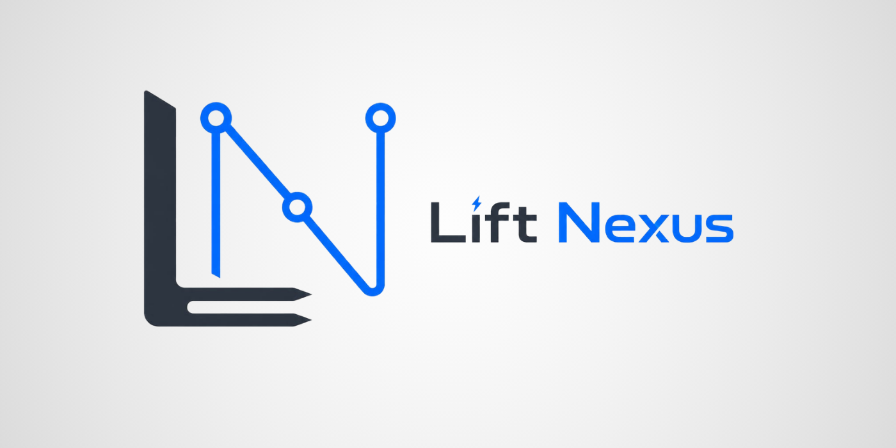

<br />
<div align="center">
  <a href="https://github.com/v1rex/lift-nexus-api">
    
  </a>

  <h3 align="center">Lift Nexus API</h3>

  <p align="center">
    Asynchronous constraint-based optimization engine for warehouse dispatching.
    Intelligently assign transport orders to forklifts using Timefold constraint programming.
    <br />
    <a href="https://github.com/v1rex/lift-nexus-api"><strong>Explore the docs »</strong></a>
    <br />
    <br />
    <a href="https://github.com/v1rex/lift-nexus-api">View Demo</a>
    &middot;
    <a href="https://github.com/v1rex/lift-nexus-api">Report Bug</a>
    &middot;
    <a href="https://github.com/v1rex/lift-nexus-api">Request Feature</a>
  </p>
</div>


<p align="right">(<a href="#-lift-nexus-api">back to top</a>)</p>

---

<!-- TABLE OF CONTENTS -->
<details>
  <summary>Table of Contents</summary>
  <ol>
    <li><a href="#about-the-project">About The Project</a></li>
    <li><a href="#built-with">Built With</a></li>
    <li><a href="#getting-started">Getting Started</a>
      <ul>
        <li><a href="#prerequisites">Prerequisites</a></li>
        <li><a href="#installation">Installation</a></li>
      </ul>
    </li>
    <li><a href="#usage">Usage</a></li>
    <li><a href="#roadmap">Roadmap</a></li>
    <li><a href="#contributing">Contributing</a></li>
    <li><a href="#license">License</a></li>
    <li><a href="#contact">Contact</a></li>
    <li><a href="#acknowledgments">Acknowledgments</a></li>
  </ol>
</details>

---

## About The Project

**Lift Nexus** solves the **Vehicle Routing Problem (VRP) with Capacity Constraints** – a classic Operations Research challenge applied to warehouse dispatching.

Intelligently assigns transport orders to forklifts inside a warehouse while respecting:
- **Capacity constraints** (weight limits per forklift)
- **Equipment requirements** (specialized lifting)
- **Travel distance optimization** (minimize deadheading)
- **Async, non-blocking dispatch** (job-based processing)

Uses **constraint-programming optimization** (Timefold solver) to find near-optimal solutions in seconds.

Perfect for warehouse optimization and intralogistics.

**Key Features:**
- 🚀 **REST API** – Manage forklifts, load units, storage bins, transport orders
- ⚙️ **Constraint Solver** – Timefold-powered optimization engine
- 🔄 **Async Dispatching** – Job-based processing with status tracking
- 📊 **Domain-Driven Architecture** – Clean DDD structure across 5 bounded contexts
- 🗄️ **PostgreSQL + Flyway** – Production-ready database with migrations
- 📖 **OpenAPI/Swagger** – Full API docs at `/swagger-ui.html`
- 🐳 **Docker Compose** – One-command local setup
- 🧪 **75%+ Test Coverage** – Unit + integration tests

<p align="right">(<a href="#-lift-nexus-api">back to top</a>)</p>

---

## Built With


<p align="right">(<a href="#-lift-nexus-api">back to top</a>)</p>

---

## Getting Started

This section explains how to get a local copy running.

### Prerequisites

- **Java 21+**
  ```bash
  java -version
  ```
- **Maven 3.8+**
  ```bash
  mvn -version
  ```
- **Docker & Docker Compose**
  ```bash
  docker --version
  docker-compose --version
  ```

### Installation

1. Clone the repository
   ```bash
   git clone https://github.com/v1rex/lift-nexus-api.git
   cd lift-nexus-api
   ```

2. Start PostgreSQL (Docker)
   ```bash
   docker-compose up -d
   ```

3. Build & run the application
   ```bash
   ./mvnw clean spring-boot:run
   ```

4. Access the application
   - **Swagger UI:** [http://localhost:8080/swagger-ui.html](http://localhost:8080/swagger-ui.html)
   - **Health Check:** `curl http://localhost:8080/actuator/health`

5. Stop the environment
   ```bash
   docker-compose down
   ```

**Expected:** App starts in ~10 seconds, Swagger UI accessible at localhost:8080

<p align="right">(<a href="#-lift-nexus-api">back to top</a>)</p>

---

## Usage

### Run Tests

```bash
./mvnw clean test           # Unit tests
./mvnw clean verify         # Full suite (includes integration)
open target/site/jacoco/index.html  # Coverage report
```

### Code Style

```bash
./mvnw spotless:apply       # Auto-format code
./mvnw spotless:check       # Check formatting
```

### Full Documentation

- **[ARCHITECTURE.md](./ARCHITECTURE.md)** – System design, DDD, technology choices, scalability
- **[CHANGELOG.md](./CHANGELOG.md)** – Features, limitations, roadmap

<p align="right">(<a href="#-lift-nexus-api">back to top</a>)</p>

---

## Roadmap

| Phase | Status | Focus | Tech Stack |
|-------|--------|-------|-----------|
| **Milestone 1** | ✅ Current | **Static Dispatching MVP** | Spring Boot 4.0.5, Timefold 2.0, PostgreSQL 16, Flyway, REST API, DDD, JPA, OpenAPI/Swagger, Testcontainers, JUnit 5 (75%+ coverage), Docker Compose |
| | | • VRP with capacity constraints solver | |
| | | • Async job-based optimization engine | |
| | | • Production-ready API structure | |
| **Milestone 2** | 🚀 Planned | **Real-Time Reactive Optimization** | Event-driven architecture, real-time updates, microservices |
| | | • Live order re-routing on demand | |
| | | • Dynamic vehicle state tracking | |
| | | • Advanced pathfinding optimization | |
| **Milestone 3** | 📈 Next Phase | **Energy Market Integration for Fleet Optimization** | Multi-objective optimization, spot-market feeds, sustainability |
| | | • Dynamic electricity tariff-aware forklift charging schedules | |
| | | • Smart charging cycles integrated with dispatch optimization | |
| | | • Grid-responsive fleet operations & cost-optimized logistics | |

**Current Focus:** Milestone 1 – Building production-ready foundation. Strategic goal: Energy-aware intralogistics targeting companies optimizing warehouse operations and electric fleet charging with sustainability & cost efficiency.

See the [open issues](https://github.com/v1rex/lift-nexus-api/issues) for a full list of proposed features.

<p align="right">(<a href="#-lift-nexus-api">back to top</a>)</p>

---

## Contributing

Contributions are welcome! To contribute:

1. Fork the project
2. Create your feature branch: `git checkout -b feature/AmazingFeature`
3. Commit your changes: `git commit -m 'feat: add AmazingFeature'` (follow [Conventional Commits](https://www.conventionalcommits.org/))
4. Push to the branch: `git push origin feature/AmazingFeature`
5. Open a Pull Request

See [CONTRIBUTING.md](./CONTRIBUTING.md) for detailed setup instructions, code standards, and testing requirements.

<p align="right">(<a href="#-lift-nexus-api">back to top</a>)</p>

---

## License

Distributed under the Apache License 2.0. See [LICENSE](./LICENSE) for more information.

```
Copyright 2026 Mohamed Amine Bahij
```

<p align="right">(<a href="#-lift-nexus-api">back to top</a>)</p>

---

## Contact

**Amine Bahij**
- GitHub: [@v1rex](https://github.com/v1rex)
- Email: medaminebahij02@gmail.com

Project Repository: [https://github.com/v1rex/lift-nexus-api](https://github.com/v1rex/lift-nexus-api)

<p align="right">(<a href="#-lift-nexus-api">back to top</a>)</p>

---

## Acknowledgments

- [Timefold](https://timefold.ai/) – Open-source constraint-programming solver
- [Spring Boot](https://spring.io/projects/spring-boot) – Enterprise Java framework
- [PostgreSQL](https://www.postgresql.org/) – Reliable RDBMS
- [Flyway](https://flywaydb.org/) – Database migrations
- [Best-README-Template](https://github.com/othneildrew/Best-README-Template) – README structure inspiration

<p align="right">(<a href="#-lift-nexus-api">back to top</a>)</p>
