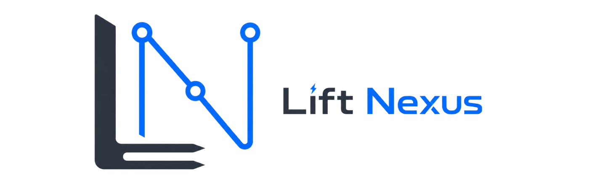

[](https://github.com/V1rex/lift-nexus-api/actions/workflows/ci.yml)
<!---  -->
[](https://v1rex.github.io/lift-nexus-api/coverage/)


<br />
<div align="center">
  <a href="https://github.com/v1rex/lift-nexus-api">
    
  </a>

  <h3 align="center">Lift Nexus API</h3>

  <p align="center">
    Spring Boot backend MVP for warehouse dispatch optimization.<br />
    Built to explore domain modeling, async job handling, PostgreSQL/Flyway persistence,
    integration testing, and Timefold-based constraint solving.
    <br />
    <br />
    <a href="https://v1rex.github.io/lift-nexus-api/"><strong>Read the docs »</strong></a>
    &middot;
    <a href="#getting-started">Getting started</a>
    &middot;
    <a href="https://github.com/v1rex/lift-nexus-api/issues">Roadmap</a>
  </p>
</div>

---

> **Status:** Portfolio / learning project. The current focus is a static dispatching MVP, not a production warehouse management system.

## About

**Lift Nexus API** models a simplified warehouse dispatching scenario where transport orders need to be assigned to forklifts.

The project goes beyond a basic CRUD API by combining:
- a warehouse domain model for forklifts, load units, storage bins, and transport orders
- asynchronous optimization jobs with status tracking
- Timefold Solver for constraint-based assignment planning
- PostgreSQL persistence with Flyway migrations
- OpenAPI documentation and Docker-based local setup
- unit and integration tests with JUnit 5 and Testcontainers

The goal is to experiment with backend architecture and optimization in a realistic intralogistics domain.

[For more infos](https://v1rex.github.io/lift-nexus-api/)

## Tech Stack


<!---  -->


## Features

- Manage forklifts, load units, storage bins, and transport orders through REST endpoints
- Start dispatch optimization as an asynchronous job
- Poll job status and retrieve optimization results
- Apply initial hard and soft constraints for forklift-to-order assignment planning
- Run locally with Docker Compose
- Validate database changes through Flyway migrations
- Generate and inspect API documentation through Swagger UI

## Getting Started

### Prerequisites

For the recommended setup:

```bash
docker --version
docker compose version
```

For local development without running the app container:

```bash
java -version
./mvnw -version
```

### Run with Docker Compose

```bash
git clone https://github.com/v1rex/lift-nexus-api.git
cd lift-nexus-api
docker compose up -d
```

The API should be available at:

- Swagger UI: `http://localhost:8080/swagger-ui.html`
- Hosted docs: `https://v1rex.github.io/lift-nexus-api/`

Stop the environment:

```bash
docker compose down
```

### Development Mode

Run PostgreSQL in Docker and start the application from your IDE or terminal:

```bash
docker compose up -d db
./mvnw clean spring-boot:run
```

## Testing and Code Quality

```bash
./mvnw clean test            # Unit tests
./mvnw clean verify          # Full verification, including integration tests
./mvnw spotless:check        # Formatting check
./mvnw spotless:apply        # Apply formatting
```

Coverage report:

```bash
open target/site/jacoco/api.html
```

## Documentation

Detailed documentation is available on GitHub Pages:

- Project overview
- Architecture and module boundaries
- Domain model
- Optimization approach
- API usage
- Testing strategy
- Known limitations
- Roadmap

Docs: **https://v1rex.github.io/lift-nexus-api/site**

For repository-level notes, see:

- [CHANGELOG.md](./CHANGELOG.md)
- [CONTRIBUTING.md](./CONTRIBUTING.md)

## Current Scope and Limitations

Lift Nexus API is an MVP / portfolio project, not a production warehouse management system yet.

Main limitations:
- No authentication or authorization yet
- Simplified warehouse topology and pathfinding
- Limited solver constraints
- Basic observability only
- Not tested in a production-like deployment environment yet

See the full [documentation](https://v1rex.github.io/lift-nexus-api/site/limitations/) for detailed limitations and planned improvements.

## Roadmap

| Milestone | Status       | Focus |
|----------|--------------|-------|
| Core MVP - Static Dispatching | 90% complete | Physical warehouse model and one-shot optimization |
| Dynamic Dispatching | Planned      | React to warehouse changes instead of running only one-shot dispatching |
| Production Constraints | Planned      | Add more realistic planning constraints such as deadlines, priorities, equipment compatibility, and energy-aware dispatching |
| Auth, Monitoring, Deployment | Planned      | Improve security, observability, and deployment readiness |
| Performance/Benchmarking | Planned      | Measure behavior under larger scenarios |

See the [open issues](https://github.com/v1rex/lift-nexus-api/issues) for the detailed task list and read [roadmap](https://v1rex.github.io/lift-nexus-api/site/roadmap/) for more infos. 

## What I Learned

This is my first larger Spring Boot project. I built it to go beyond simple CRUD applications and practice backend architecture in a more realistic domain.

Coming from an academic optimization background, where I previously worked with mathematical modeling in GurobiPy, this project helped me understand how optimization can be integrated into a real backend application using Timefold.

Through this project, I learned and applied:
- domain modeling for warehouse dispatching
- asynchronous job handling
- database migrations with Flyway
- integration testing with PostgreSQL and Testcontainers
- separating API, service, persistence, and planning concerns
- constraint solving with Timefold
- documenting architectural trade-offs and limitations

## Contributing

This is mainly a personal learning and portfolio project, but feedback and suggestions are welcome.

1. Fork the project
2. Create a feature branch: `git checkout -b feature/my-change`
3. Commit your changes using Conventional Commits
4. Push your branch
5. Open a pull request

See [CONTRIBUTING.md](./CONTRIBUTING.md) for more details.

## License

Distributed under the Apache License 2.0. See [LICENSE](./LICENSE) for more information.

```text
Copyright 2026 Mohamed Amine Bahij
```

## Contact

**Amine Bahij**

- GitHub: [@v1rex](https://github.com/v1rex)
- Email: medaminebahij02@gmail.com
- Project: [https://github.com/v1rex/lift-nexus-api](https://github.com/v1rex/lift-nexus-api)

## Acknowledgments

- [Timefold](https://timefold.ai/) – Constraint solver
- [Spring Boot](https://spring.io/projects/spring-boot) – Java application framework
- [PostgreSQL](https://www.postgresql.org/) – Relational database
- [Flyway](https://flywaydb.org/) – Database migrations
- [Best-README-Template](https://github.com/othneildrew/Best-README-Template) – Original README structure inspiration
