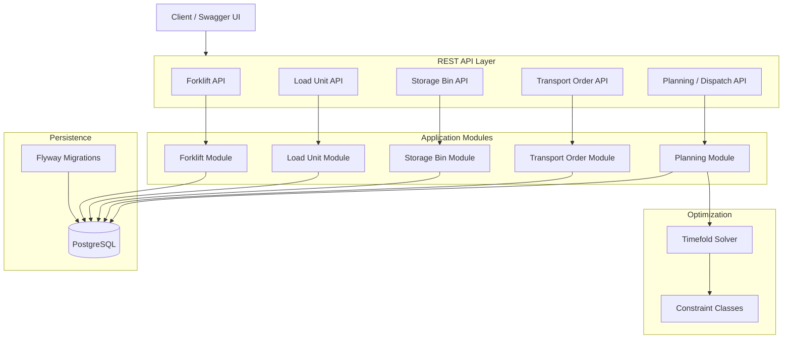
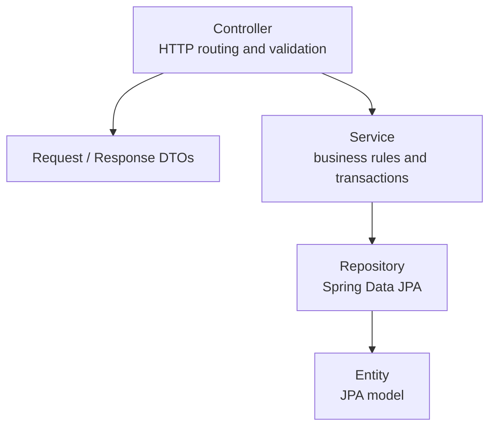
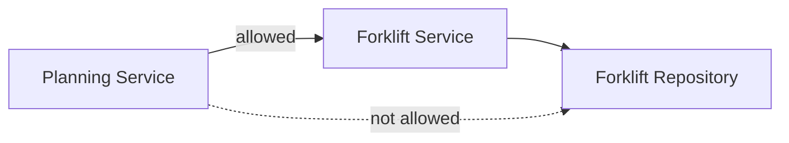
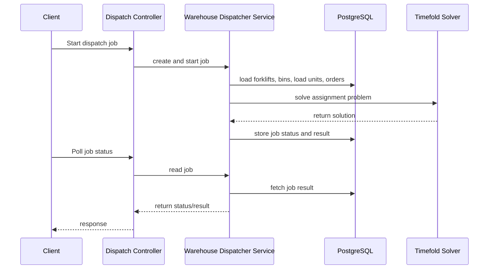
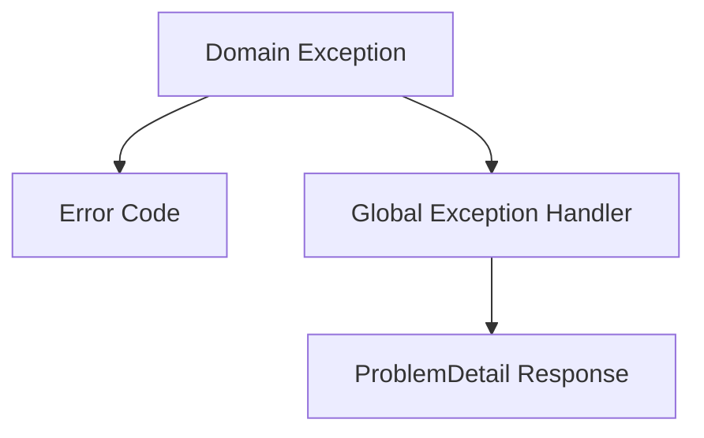
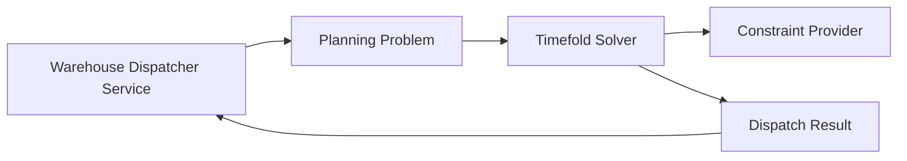

# Architecture

Lift Nexus API is currently built as a **modular monolith**. The goal is to keep the project simple to run and understand while still separating the main warehouse dispatching concerns into clear modules.

This page documents the current architecture decisions, module boundaries, communication rules, and known trade-offs. It focuses on the current MVP state, not a future production system.

!!! info "Project status"
    Lift Nexus API is a portfolio / learning project. The current architecture is designed for a [static dispatching MVP](roadmap.md) and is expected to evolve as the project grows.

---

## Architecture philosophy

!!! dev-note "Developer note"
    The architecture of Lift Nexus API follows a simple principle: **keep the system understandable first, then evolve it when the problem requires it**. Overcomplicating the system too early, while I am still learning the domain, would be overkill.

    For this MVP, I prefer clear module boundaries, simple deployment, and testable application logic over introducing distributed infrastructure too early. The goal is not to build the most advanced architecture possible, but to build an architecture that matches the current project scope, helps me learn how to integrate Timefold into a backend application, and helps me reason about the domain.

    In practice, this means organizing code around warehouse capabilities, keeping controllers thin, avoiding direct repository access across modules, and documenting trade-offs instead of hiding them.

    Core Philosophy: "Start Small".


---

## Why a modular monolith?

!!! dev-note "Developer note"
    I intentionally chose a modular monolith because this is a learning project and I decided not to introduce distributed-system complexity too early.

    I am still learning architecture patterns such as microservices and event-driven systems. For this project, I wanted to focus first on understanding the warehouse domain, building a clean Spring Boot backend, integrating persistence and testing, and connecting an optimization solver to the application.

    The current package boundaries let me practice modular design while keeping the system simple to run, debug, and evolve.

    At this stage, adding distributed architecture would make the prototype harder to understand, run, debug, and test without solving the main learning goal yet. The current package boundaries let me practice modular design while keeping the system simple to evolve.

---

## Module overview

The codebase is organized by business capability rather than by technical layer.

```text
src/main/java/com/v1rex/liftnexus/
├── common/
├── forklift/
├── loadunit/
├── storagebin/
├── transportorder/
└── planning/
```

| Module | Responsibility |
|---|---|
| `common` | Shared exception handling and reusable infrastructure concerns |
| `forklift` | Forklifts and forklift types |
| `loadunit` | Physical load units stored in the warehouse |
| `storagebin` | Simplified warehouse storage locations |
| `transportorder` | Orders that move load units from source to target bins |
| `planning` | Dispatch jobs, solver orchestration, and Timefold integration |

---

## High-level architecture



The `planning` module is the orchestration point for dispatch optimization. It loads the required warehouse state, starts the solver process, tracks the dispatch job, and stores the result.

---

## Layering inside a module

Most modules follow the same basic structure:



### Controller layer

Controllers should stay thin. Their main responsibilities are:

- expose REST endpoints
- validate input with framework annotations
- map requests and responses
- delegate business logic to services

### Service layer

Services contain the application logic:

- transaction boundaries
- business rule checks
- cross-module orchestration
- domain-specific exceptions
- entity lifecycle operations

### Repository layer

Repositories are responsible for persistence through Spring Data JPA. Database schema changes are managed through Flyway migrations.

---

## Module boundary rules

The project intentionally avoids direct repository access across modules.



The rule is:

!!! important
    A service from one module should not inject a repository from another module. Cross-module access should always go through the other module's service layer.

This keeps module boundaries visible and prevents the planning module from becoming tightly coupled to every persistence detail in the system.


!!! dev-note "Developer note"
    This boundary rule is something I started using in another project and reused here because it made the code easier for me to understand and refactor.

    The planning module needs information from forklifts, storage bins, load units, and transport orders, but it should not know the persistence details of those modules. Going through services keeps those boundaries visible.

---

## Dispatch flow

The current MVP supports a static, one-shot optimization flow.



This flow is intentionally simple. The current system does not continuously react to every warehouse event yet. Dynamic dispatching is planned as a later milestone.

---

## Exception handling

The project uses a shared exception approach based on:

- domain-specific exceptions
- machine-readable error codes
- a global exception handler
- consistent error responses



This makes API errors more predictable than returning ad-hoc exception messages from different controllers.

The current design is useful for a structured API, but it is also intentionally simple. It can be improved later with more detailed error documentation in the API reference.

---

## Planning and optimization module

The planning module is responsible for connecting the backend application with Timefold Solver.



The constraint provider delegates individual business rules to separate constraint classes where possible. This keeps the optimization logic easier to read and test than placing every rule in a single large class.

Examples of current or planned constraint categories:

- forklift capacity
- equipment compatibility
- travel distance / deadheading
- order priority
- deadlines
- energy-aware dispatching

More detail is documented in the [Optimization Approach](optimization.md) page.

---

## Current trade-offs

The current architecture is intentionally pragmatic. Some choices are good enough for the MVP, but not final.

### JPA model and optimization model are still close

Some model classes currently serve both persistence and optimization needs. This is acceptable for the MVP, but it couples the database model to the solver model.


### Services may grow over time

The current project follows a "thin controller, thicker service" style. This is simple and readable for the MVP, but larger workflows can make services too broad.

Possible future improvements:

- command/query handlers
- clearer application services
- dedicated orchestration classes for planning workflows

### Dynamic dispatching is not implemented yet

The current architecture focuses on static dispatching. The system starts an optimization job based on the current state and returns a result. It does not yet continuously react to warehouse changes in real time.

!!! dev-note "Developers note"
    Some edge are still not yet to be covered: What happens when the state of warehouse changes during solving? How to trigger re-optimization when new orders arrive or forklifts break down?


---

## Why this architecture is useful for the project

This architecture gives the project a structure that is more realistic than a basic CRUD application while still staying manageable for a single-developer portfolio project.

It supports the current goals:

- model a warehouse dispatching domain
- expose a clean REST API
- persist state in PostgreSQL
- run asynchronous dispatch jobs
- integrate Timefold Solver
- test persistence and application logic
- document current limitations clearly

The design is not meant to be final. It is a foundation for learning, iteration, future improvements and experimentation. 
