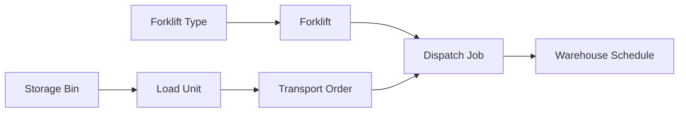
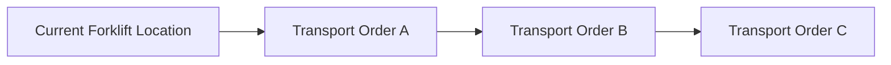
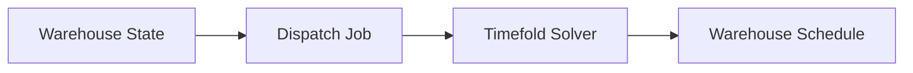
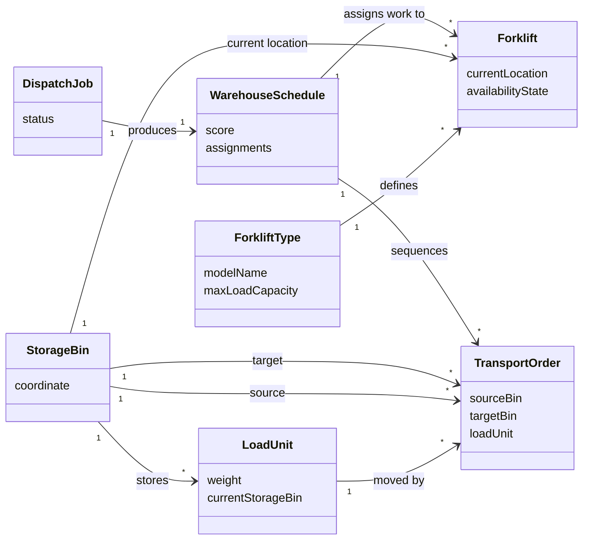

# Domain Model

Lift Nexus API models a simplified warehouse dispatching domain.

The current MVP focuses on the objects needed to create a warehouse state, start a dispatch job, and assign transport orders to forklifts.

!!! info "MVP scope"
    The domain model is intentionally simplified. It is designed to support the current static dispatching workflow, not to represent every detail of a real warehouse management system.

---

## Domain overview

The main domain concepts are:

- **Forklift Types** define the technical capabilities of forklifts.
- **Forklifts** execute transport orders.
- **Storage Bins** represent warehouse locations.
- **Load Units** represent physical goods or containers stored in the warehouse.
- **Transport Orders** describe movements from a source bin to a target bin.
- **Dispatch Jobs** represent optimization runs.
- **Warehouse Schedule** represents the assignment result of a dispatch job.



---

## Forklift Types 

A forklift type describes the technical category of a forklift.

It can define properties such as:

- model name 
- maximum load capacity
- physical or operational characteristics

In the current MVP, forklift types are useful because not every forklift should be treated as identical. Different forklifts may have different capacities and therefore may not be able to execute every transport order.

Example: 

- Small electric forklift
    - lower capacity
    - useful for lighter load units

- Heavy forklift
    - higher capacity
    - useful for heavier load units


---

## Forklifts 

A forklift represents a vehicle that can execute transport orders inside the warehouse.

A Forklift has: 

- a [forklift type](#forklift-types-)
- a current [storage bin](#storage-bins-) (current location of the Forklift inside the warehouse)
- an availability state (e.g., available, busy)
- a list of assigned transport orders during planning

In the optimization model, forklifts are part of the planning problem and receive ordered transport assignments.

The order of assigned transport orders matters because the forklift's next travel distance depends on where the previous order ended.



!!! note "Why order matters"
    The system does not only decide which forklift handles an order. It also considers the sequence of orders assigned to a forklift, because each completed order changes the forklift's next starting location.

--- 

## Storage Bins 

A storage bin represents a location inside the warehouse.

In the current MVP, storage bins have coordinates. These coordinates are used to estimate distances between locations.

A storage bin can be used as: 

- the current location of a forklift 
- the current location of a load unit 
- the source location of a transport order 
- the target location of a transport order

The current distance model is simplified and based on warehouse coordinates. It does not yet model real warehouse paths, aisles, blocked zones, or traffic rules.

See [Known Limitations](limitations.md#simplified-warehouse-topology) for more detail.


## Load Units 

A load unit represents a physical item, pallet, container, or unit that can be moved inside the warehouse.

A load unit can have:

- weight
- current storage bin
- identifying information

Transport orders usually refer to a load unit that needs to be moved from one storage bin to another.

The weight of a load unit is important because the assigned forklift must be able to carry it.

--- 


## Transport Orders

A transport order describes a movement that should happen inside the warehouse.

A transport order connects:

- a load unit
- a source storage bin
- a target storage bin

In the current MVP, transport orders are the main work items that need to be assigned to forklifts.

A simplified transport order answers:
```
Move this load unit from this source bin to this target bin.
```

During optimization, transport orders are assigned to forklifts and arranged in a sequence.

## Dispatch Jobs 

A dispatch job represents one optimization run.

The current MVP uses a static dispatching workflow:

1. The current warehouse state is available.
2. A dispatch job is created.
3. The solver receives the planning problem.
4. Timefold calculates a solution.
5. The resulting assignments are stored.



Dispatch jobs make the optimization workflow explicit. Instead of directly assigning orders inside a controller, the system treats solving as a separate process with its own status and result.

---

## Warehouse Schedule 

The warehouse schedule represents the assignment result of a dispatch job.

It describes:

- which transport orders were assigned
- which forklift should execute them
- in which sequence they should be executed
- what score or planning result was produced by the solver

The current result should be understood as a planning recommendation for the simplified MVP, not as a real-world executable warehouse schedule.

---

## Simplified relationship summary 



!!! warning "Simplified model"
    This diagram is meant to explain the current domain concepts. It is not a complete production warehouse data model.

---

## Current model boundaries 

The current domain model intentionally does not include every possible warehouse concept.

Not yet modeled in detail:

- users and roles
- real warehouse topology
- traffic rules
- charging stations
- battery-aware dispatching
- operator shifts
- real-time execution tracking
- external warehouse systems

These boundaries keep Milestone 1 focused on the core dispatching problem.
