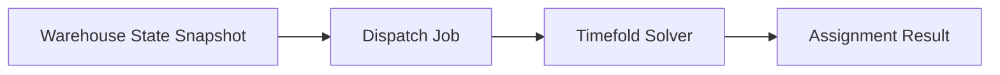

# Known Limitations

Lift Nexus API is currently a portfolio / learning project and not a production warehouse management system.

This page documents the current limitations intentionally. The goal is to keep the project scope honest and make future improvements easier to reason about.

---

## Current MVP scope

The current implementation focuses on a **static dispatching workflow**.

That means the system takes the current warehouse state as a snapshot, creates a dispatch job, runs the solver, and stores the resulting assignments.

The system does not yet continuously react to warehouse changes while a plan is being executed.

---

## No authentication or authorization yet

The current API does not include user accounts, authentication, authorization, or role-based access control.

In a production system, this would be required to protect endpoints for:

- warehouse operators
- dispatch planners
- administrators

For the current MVP, security is intentionally out of scope because the focus is on the domain model, persistence, dispatch workflow, and solver integration.

---

## Simplified warehouse topology

The current system uses warehouse coordinates to estimate distances using [Manhattan distances](https://en.wikipedia.org/wiki/Taxicab_geometry).

This keeps the MVP understandable, but it does not yet model a full warehouse topology with:

- aisles
- blocked paths
- one-way routes
- traffic rules
- restricted zones
- charging areas
- real pathfinding between locations

This means the current distance calculation is useful for a simplified planning model, but it is not yet equivalent to real warehouse navigation.

Future versions should focus on a better warehouse topology model before trying to optimize more realistic routes. 

---

## Limited optimization constraints

??? dev-note "Developer note"
    One lesson I want to keep in mind for this MVP: more constraints do not automatically make the model better.

    A smaller constraint model is easier to understand, test, and improve step by step.

The current solver model focuses on a small set of planning constraints.

The MVP already considers important dispatching aspects such as forklift capacity, transport orders, and travel distance. However, a real warehouse dispatching system would need more constraints, for example:

- order deadlines
- order priorities
- forklift battery level
- charging requirements
- driver or shift availability
- richer equipment compatibility rules
- blocked or unavailable storage bins
- congestion and traffic inside the warehouse
- service times for pickup and drop-off

The current constraint model is intentionally limited so the first version stays understandable and testable.

---

## Static dispatching only

The current dispatching workflow is static.

A dispatch job is created from the warehouse state at one point in time. If new transport orders are created, forklifts become unavailable, or the warehouse state changes during execution, the current plan is not automatically updated.

A more advanced version could support dynamic dispatching, where the system reacts to new events and recalculates assignments when needed.

Examples of events that could trigger replanning:

- new transport order created
- forklift becomes unavailable
- load unit changes location
- storage bin becomes blocked
- high-priority order arrives
- forklift battery becomes low

??? note "Future research focus"
    Before implementing dynamic dispatching, I need to better understand how Timefold supports problem changes, replanning, and long-running solver workflows.

---

## No production deployment setup yet
The project currently focuses on local development and CI-generated documentation.

It does not yet include a production deployment setup with:

- secrets management
- production database configuration
- system monitoring
- alerting
- log aggregation

The current GitHub Pages deployment is only for project documentation and reports. It is not an application deployment.

---

## Basic observability only

The current system does not yet include production-grade observability.

A real backend system would need better visibility into:

- dispatch job execution time 
- failed jobs 
- database errors 
- solver score and constraint explanations
- system health 
- logs and traces 

Future versions could add structured logging, metrics, health checks, and tracing.

---

## Limited test coverage

The project includes unit and integration tests, including PostgreSQL/Testcontainers-based testing.

However, the test suite is still evolving. Areas that need stronger test coverage include:

- Error Handling
    - What happens when the solver fails?
- Edge Cases
    - What if there are no available forklifts?
    - What if transport orders have conflicting requirements?

The current goal is not only to increase coverage numbers, but to make the tests more meaningful around the most important business behavior.

---

## No real-world validation yet

The current model is based on a simplified warehouse scenario.

It has not yet been validated against:

- real warehouse layouts
- real forklift movement data
- real transport order history
- real operational constraints
- production traffic patterns
- warehouse operator feedback

Because of that, the project should be understood as a technical MVP and learning project, not as a validated industrial optimization product.

---

## Summary 

The current limitations are intentional for Milestone 1.

The goal of the MVP is to build a clean foundation:

- understandable domain model 
- modular backend structure 
- persistence with PostgreSQL/Flyway 
- dispatch job workflow 
- Timefold solver integration 
- tests, documentation, and CI reports

Future milestones can build on this foundation by adding dynamic dispatching, richer constraints, better topology modeling, energy-aware planning, and production-readiness improvements.