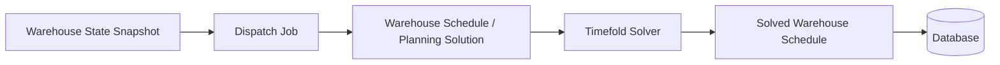
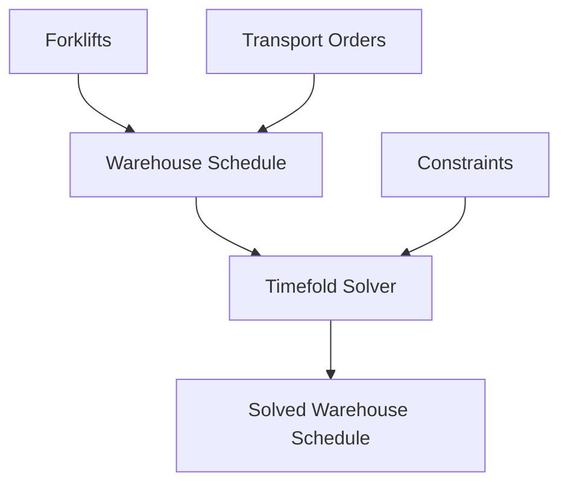

# Optimization Approach

Lift Nexus API uses Timefold Solver to experiment with constraint-based warehouse dispatching.

The current MVP focuses on **static dispatching**. The system takes the current warehouse state, creates a dispatch job, builds a warehouse schedule, sends it to the solver, and stores the solved schedule after optimization.

!!! info "MVP scope"
    The optimization model is intentionally small. The goal of Milestone 1 is to understand how an optimization solver can be integrated into a Spring Boot backend, not to model every real warehouse constraint yet.

---

## Why Timefold?

Timefold is used because the problem is constraint-based.

The project does not only need to store warehouse data. It needs to search for a good assignment and sequence of transport orders under constraints.

Using a solver allows the project to express planning rules as constraints and let the solver search for a better schedule.

For this MVP, Timefold helps explore how optimization can be integrated into a backend application with:

- REST APIs
- persistence
- asynchronous dispatch jobs
- stored planning results
- tests and documentation

---

## What are hard and soft constraints in Timefold?

The project uses score-based optimization.

A useful way to think about the model is:

- **hard constraints** define rules that should not be violated
- **soft constraints** define preferences that should be optimized

For example:

```text
Hard constraint:
A forklift should not receive work it cannot physically handle.

Soft constraint:
Prefer schedules with shorter travel distance.
```

This separation is useful because not every rule has the same importance.

Some rules are required for a valid solution. Other rules improve the quality of the solution.

---

## What gets optimized?

The current problem is a simplified vehicle routing and dispatching problem.

Given:

- a set of forklifts
- a set of open transport orders
- current forklift locations
- source and target storage bins
- load units and their weights

the solver should produce a warehouse schedule that answers:

> Which forklift should execute which transport order, and in which sequence?

This is more than a simple assignment problem because the order of transport orders matters. After a forklift completes one transport order, its next starting location changes.


!!! note "Why sequence matters"
    If a forklift executes Order A before Order B, the travel distance can be different than executing Order B before Order A. The route sequence therefore affects the quality of the solution.

---

## Static dispatching workflow

The current optimization workflow is static.



A dispatch job represents one optimization run.

The application builds a `WarehouseSchedule` from the current warehouse state. This schedule acts as the planning solution that is passed to Timefold Solver.

Before solving, the warehouse schedule contains the planning data. After solving, it contains the optimized assignment and sequence of transport orders.

The solver does not directly update the database. The application receives the solved schedule and then persists the result or updates the relevant database state.

The current workflow is static. If the warehouse state changes later, the current MVP does not automatically update the plan.

See [Known Limitations](limitations.md#static-dispatching-only) for more detail.

---

## Planning model

The planning model is centered around the `WarehouseSchedule`.

In the current MVP, the warehouse schedule acts as the planning solution. It collects the data needed by the solver and later contains the optimized result.

The important planning concepts are:

- **Warehouse Schedule**: the planning solution passed to Timefold
- **Forklifts**: vehicles that can execute transport orders
- **Transport Orders**: work items that need to be assigned and sequenced
- **Storage Bins**: source, target, and current locations
- **Load Units**: physical units moved by transport orders
- **Score**: the optimization result that describes solution quality

At a high level, Timefold receives a warehouse schedule, assigns and sequences transport orders for forklifts, and returns a solved warehouse schedule.



---

## Current constraints

The current constraint model is intentionally limited.

The MVP focuses on a small set of constraints that are enough to make the first dispatching workflow meaningful and understandable.

Current constraints include:

- **Forklift capacity limit**  
  A forklift should not receive a transport order if the load unit is heavier than the forklift type's maximum capacity.

- **Transport order equipment requirement**  
  A transport order that requires a specific equipment type should be assigned to a forklift with a matching equipment type.

- **Forklift travel distance**  
  The solver should prefer schedules where forklifts travel less total distance.

The first two constraints are hard constraints. They describe rules that should not be violated.

The travel distance constraint is a soft constraint. It improves the quality of the solution by preferring shorter routes.

!!! dev-note "Developer note"
    More constraints do not automatically make the model better.

    For the current MVP, I prefer a smaller constraint model that I can understand, test, and improve step by step.

---

### Forklift capacity constraint

The forklift capacity constraint checks whether a forklift can physically carry the load unit of a transport order.

If a transport order is assigned to a forklift, the load unit weight should not exceed the forklift type's maximum capacity.

Simplified:

```text
load unit weight
must be less than or equal to
assigned forklift maximum capacity
```

If the load unit is too heavy for the assigned forklift, the solution receives a hard penalty.

This prevents the solver from creating schedules where a forklift receives work that it cannot physically handle.


---

### Equipment requirement constraint

One current hard constraint checks whether a transport order requires a specific equipment type.

If a transport order has a required equipment type, the assigned forklift should have a matching equipment type through its forklift type.

Simplified:

```text
transport order required equipment
must match
assigned forklift equipment type
```
If the required equipment does not match the assigned forklift's equipment type, the solution receives a hard penalty.

This keeps the solver from treating all forklifts as interchangeable. Some transport orders may require equipment that only certain forklift types can provide.

### Travel distance constraint

One important soft constraint is forklift travel distance.

The idea is to penalize schedules where forklifts travel more than necessary.

For each forklift, the distance calculation follows the sequence of assigned transport orders:

1. Start at the forklift's current location.
2. Travel to the source bin of the first transport order.
3. Move from the source bin to the target bin.
4. Use the target bin as the next starting location.
5. Repeat this for the next assigned transport order.

Simplified:


This makes the sequence of transport orders important. A different order can produce a different total travel distance.

!!! warning "Simplified distance model"
    The current MVP uses warehouse coordinates to estimate travel distance. It does not yet use a full warehouse topology with aisles, blocked paths, one-way routes, or real pathfinding.

See [Known Limitations](limitations.md#simplified-warehouse-topology) for more detail.

---

## What the current optimization does not do yet

The current optimization model is not a complete real-world warehouse optimizer.

It does not yet include:

- real warehouse pathfinding
- dynamic replanning while orders are being executed
- forklift battery level
- charging decisions
- operator shifts
- traffic or congestion inside the warehouse
- real-time telemetry
- validated real-world warehouse data

These limitations are intentional for the current milestone.

The goal is to first build a working and understandable optimization foundation before adding more realistic planning behavior.

See [Known Limitations](limitations.md) and [Roadmap](roadmap.md) for more detail.

---

## Future optimization directions

Future milestones may improve the optimization model with:

- dynamic dispatching and replanning
- richer transport order priorities
- better warehouse topology modeling
- more realistic travel-distance calculations
- energy-aware forklift charging decisions
- benchmark scenarios with larger datasets
- comparison against simple baseline assignment strategies

The long-term goal is to make optimization quality visible and measurable instead of only saying that the solver works.

See [Roadmap](roadmap.md) for more detail.