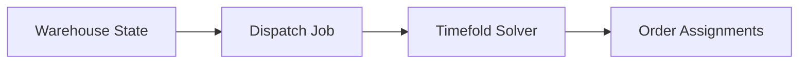

# Project Overview

[Lift Nexus API](../../)  is a Spring Boot backend MVP for warehouse dispatch optimization.

The project models a simplified warehouse environment where forklifts move load units between storage bins based on transport orders. The current goal is to support a static dispatching workflow: create the warehouse state, start an optimization job, and assign transport orders to forklifts using Timefold Solver.

!!! info "Project status"
    Lift Nexus API is a portfolio / learning project. It is not a production warehouse management system yet.

---

## Why this project exists

I built [Lift Nexus API](../../) to practice backend architecture beyond simple CRUD applications.

The project combines two areas I am interested in:

- backend systems and software architecture
- operations research / constraint-based optimization

Coming from an academic optimization background, I have often seen models implemented as standalone scripts or notebooks.

With this project, I wanted to explore how an optimization model can be integrated into a backend application with APIs, persistence, asynchronous jobs, tests, documentation, and CI-generated reports.

---

## Problem domain

In a warehouse, transport orders describe movements that need to happen, for example moving a load unit from one storage bin to another.

A simplified dispatching problem is:

> Given a set of forklifts and open transport orders, decide which forklift should handle which order and in which sequence.

This is a simplified vehicle routing and dispatching problem inspired by [classical Vehicle Routing Problem](https://en.wikipedia.org/wiki/Vehicle_routing_problem) variants in logistics. In the current MVP, the route model is still simplified: distances are calculated from warehouse coordinates instead of a full pathfinding/topology model.

Even in a simplified MVP, this decision can depend on several factors:

- forklift availability
- load unit weight
- forklift capacity
- source and target locations
- estimated travel distance
- compatibility between forklifts and tasks

The current MVP does not try to model a full warehouse management system. 
Instead, it focuses on a smaller optimization problem that is easier to understand and extend. The goal is to have a basis for future milestones that is extensible.

---

## Current MVP scope

The current implementation focuses on **static dispatching**.

That means the system takes the current warehouse state as a snapshot, creates a dispatch job, runs the solver, and stores the result.

The MVP currently includes:

- warehouse domain entities such as forklifts, load units, storage bins, and transport orders
- REST APIs for managing the warehouse state
- PostgreSQL persistence with Flyway migrations
- asynchronous dispatch job handling
- Timefold-based assignment optimization
- generated OpenAPI reference 
- integration tests with PostgreSQL/Testcontainers 
- CI-generated reports for coverage, Javadoc, and test results

---

## What the project is not yet 

Lift Nexus API is not production-ready yet.

The current version intentionally does not include every concern that a real warehouse system would need.

Current limitations include:

- no authentication or authorization yet
- simplified warehouse topology and pathfinding
- limited solver constraints
- basic observability only
- no production deployment setup yet
- dispatch behavior is currently static, not continuously reactive
- not tested in a production-like deployment environment

These limitations are documented openly because they are part of the current MVP scope and should be taken into account when developing future versions.

See [Known Limitations](limitations.md) for more detail.

---

## How the system is used 

A typical local usage flow is: 

1. Start the application and PostgreSQL database. 
2. Create warehouse data, such as forklift types, forklifts, storage bins, and load units
3. Create transport orders. 
4. Start a dispatch job. 
5. Poll the job status. 
6. Inspect the resulting assignments.

The detailed API flow is documented in [API Usage](api-usage.md).

---

## Documentation map 
The documentation is split into focused pages: 

- [Architecture](architecture.md) explains the modular monolith structure and module boundaries. 
- [Domain Model](domain-model.md) explains the main warehouse concepts. 
- [Optimization Approach](optimization.md) explains how Timefold is used. 
- [API Usage](api-usage.md) shows how to run and use the API. 
- [Testing Strategy](testing.md) explains the test setup and CI reports. 
- [Known Limitations](limitations.md) documents current simplifications. 
- [Roadmap](roadmap.md) describes planned milestones.

---

## Long-term direction

The current MVP is the first step toward a more realistic warehouse dispatching engine.

Future work may build on this foundation with:

- dynamic dispatching when warehouse state changes
- richer planning constraints
- better pathfinding and topology modeling
- energy-aware forklift charging decisions
- stronger observability and deployment readiness
- benchmarking with larger scenarios

The long-term direction is to explore how backend systems can integrate operations research models into usable software applications that can optimize real warehouse operations.