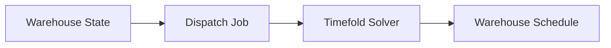

# Roadmap

This roadmap describes the planned evolution of Lift Nexus API.

The project is developed step by step. The current priority is to keep the MVP understandable, working, and well documented before adding more advanced warehouse behavior.

!!! info "Roadmap scope"
    This roadmap is not a fixed product commitment. It is a planning document for the current learning and portfolio project.

---

## Current focus

The current focus is to finish **Milestone 1: Core MVP - Static Dispatching**.

The goal of this milestone is to build a clean backend foundation that can model a simplified warehouse state and run a one-shot optimization job with a limited constraint set.

[View Milestone 1 on GitHub](https://github.com/V1rex/lift-nexus-api/milestone/1)

---

## Milestone 1: Core MVP - Static Dispatching

Milestone 1 focuses on the first working version of the project.

The system should be able to:

- model forklifts, forklift types, storage bins, load units, and transport orders
- persist warehouse data with PostgreSQL and Flyway
- expose REST APIs for the current warehouse model
- create and execute dispatch jobs
- use Timefold Solver for static transport order assignment
- store and inspect the resulting warehouse schedule
- generate OpenAPI documentation
- provide CI-generated reports for tests, coverage, and Javadoc
- document the current architecture, limitations, and API usage

The dispatching workflow is static. The solver receives a snapshot of the current warehouse state, calculates a solution, and stores the result.

### Completion goal 

Milestone 1 should be considered complete when the project can be run locally, the static dispatching flow works, the documentation is usable, and the project can be presented as a stable MVP.

---

## Milestone 2: Dynamic Dispatching

Milestone 2 moves the project from a one-shot optimization tool toward a more reactive dispatching engine.

[View Milestone 2 on GitHub](https://github.com/V1rex/lift-nexus-api/milestone/2)

The goal is to explore how the system should react when the warehouse state changes.

Examples of future changes:

- new transport orders are created 
- forklifts become unavailable 
- solver jobs fail or need status updates 
- transport priorities change 
- forklift telemetry becomes relevant 
- the system needs stronger orchestration around solver execution

!!! note "Research focus"
    This milestone is intentionally more difficult than Milestone 1 because it introduces dynamic behavior. Before implementing too much, the project needs research around Timefold problem changes, replanning, and long-running solver workflows.

!!! note "Developer note"
    Milestone 2 should not be rushed. Dynamic dispatching adds complexity, so the first goal is to understand the problem before adding too much infrastructure.

---

## Milestone 3: Richer Planning Constraints

Milestone 3 focuses on making the optimization model more realistic.

[View Milestone 3 on GitHub](https://github.com/V1rex/lift-nexus-api/milestone/7)

Possible directions:

- richer transport order priorities 
- stronger capacity and compatibility constraints 
- better warehouse topology assumptions 
- more realistic travel-distance calculation 
- blocked or unavailable warehouse locations 
- better handling of solver scores and planning trade-offs

The goal is not to add constraints blindly. The goal is to add constraints that make the model more useful while keeping it understandable and testable.

---

## Milestone 4: Application Hardening

Milestone 4 focuses on technical hardening around the backend application.

[View Milestone 4 on GitHub](https://github.com/V1rex/lift-nexus-api/milestone/5)

Possible directions:

- authentication and authorization 
- better application configuration 
- production-oriented Docker setup 
- container image publishing 
- health checks 
- structured logging 
- monitoring and basic metrics 
- deployment documentation

The current GitHub Pages deployment is only for documentation and reports. This milestone would move the application closer to a production-like backend setup.

---

## Milestone 5: Performance and Benchmarking

Milestone 5 focuses on measuring how the system behaves with larger scenarios.

[View Milestone 5 on GitHub](https://github.com/V1rex/lift-nexus-api/milestone/6)

Possible directions:

- generate larger warehouse scenarios 
- compare solver results against simple baseline assignment strategies 
- measure solver duration 
- measure total travel distance 
- document benchmark scenarios
- improve test data generation

The goal is to make optimization quality and performance more visible instead of only saying that the solver works.

---

## Long-term direction

The long-term direction is to explore how backend systems can integrate operations research models into usable software applications.

Future ideas may include:

- energy-aware forklift charging decisions 
- better warehouse topology modeling 
- integration with external systems 
- more realistic operational constraints

These ideas are intentionally kept for later. The current priority is to finish the static dispatching MVP first.